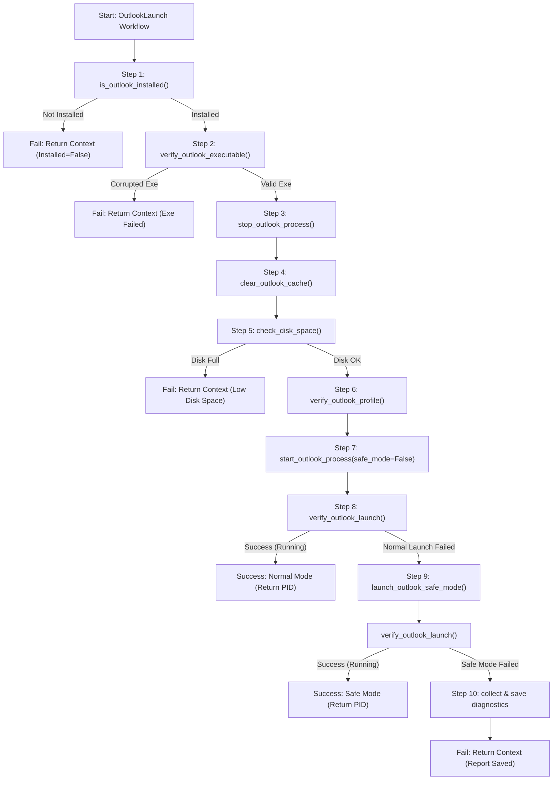

# Development Progress & Engineering Journal

**Project:** AI IT Support Agent  
**Repository:** `ai-it-support-agent`  
**Current Architecture Status:** Layered Execution Flow (Frontend → Router → Selector → Registry → Workflows → Automations)  

---

## [2026-07-27] Major Task: Teams Launch Integration & System Architecture Audit

### 1. What Was Implemented / Audited
- Conducted a comprehensive architectural audit of the backend system following the addition of the `TeamsLaunch` workflow.
- Identified and fixed critical integration gaps in `backend/workflow_registry.py` and `backend/workflow_selector.py`.
- Added process check fallback handling in `automations/teams/health.py`.
- Verified end-to-end functional execution for `TeamsUpdate`, `TeamsLaunch`, and `Unknown` responses.

### 2. Architectural Decisions Made
- **Strict Layered Separation**: Reaffirmed responsibilities across layers:
  - `routes.py`: Zero business logic; HTTP request parsing only.
  - `workflow_selector.py`: Intent mapping only; no direct execution.
  - `workflow_registry.py`: Centralized workflow map & dispatch.
  - `workflows/`: Orchestration only using standard `WorkflowContext`.
  - `automations/`: Atomic, reusable OS/System primitives; no workflow or HTTP awareness.
- **Graceful Failover in Automations**: Added PowerShell `Get-Process` fallback to `automations/teams/health.py` to prevent environment failures when `psutil` is not installed.

### 3. New / Fixed Automation Functions Introduced
- `automations/teams/health.py`:
  - Enhanced `is_teams_running()` with native PowerShell fallback (`Get-Process -Name ms-teams, Teams`).
  - Implemented `wait_for_teams_launch(timeout=15)` and `verify_launch()`.

### 4. Workflows Completed & Verified
- **`TeamsUpdate`**: `check_teams_connectivity` → `get_installed_teams_version` → `stop_teams_process` → `clear_teams_cache` → `trigger_teams_update` → `get_installed_teams_version` → `start_teams_process`.
- **`TeamsLaunch`**: `is_teams_installed` → `verify_executable` → `stop_teams_process` → `clear_teams_cache` → `check_disk_space` → `check_runtime_dependencies` → `start_teams_process` → `verify_launch` → `collect_diagnostics` (on failure).

### 5. Reusable Components Introduced / Identified
- Reused `stop_teams_process()`, `start_teams_process()`, and `clear_teams_cache()` across both `TeamsUpdate` and `TeamsLaunch`.
- Reused `check_disk_space()` and diagnostic collection patterns.

### 6. Known Issues / Technical Debt
- **14 Empty Stub Files**: Multiple 2-byte placeholder files exist in `graph/`, `llm/`, `workflows/`, `utils/`, and `automations/` (`outlook_launch.py`, `outlook_sync.py`, `dns.py`, `vpn.py`, `audio.py`, `camera.py`, etc.).
- **Redundant Installation Checks**: `installation.py` (`is_teams_installed`) and `version.py` (`get_installed_teams_version`) overlap in detection logic.

### 7. Next Recommended Task
- Refactor `workflow_selector.py` to use a keyword scoring system.

---

## [2026-07-27] Major Task: Keyword Scoring Workflow Selector Refactoring

### 1. What Was Implemented
- Refactored `backend/workflow_selector.py` from naive string matching to an extensible keyword scoring algorithm (`select`).
- Added normalized text processing (`_normalize_text`) for lowercase conversion, contraction handling (`isn't` → `isnt`, `won't` → `wont`), and punctuation removal.
- Constructed `WORKFLOW_KEYWORDS` catalog for `TeamsUpdate` and `TeamsLaunch`.

### 2. Architectural Decisions Made
- **Action/Problem Keyword Focus**: Excluded generic app names (`teams`, `outlook`, `microsoft`) from scoring to prevent false-positive intent matching.
- **Phrase Weighting**: Multi-word phrases (e.g., `update failed`, `won't open`) carry higher score weights proportional to word length (`len(phrase.split())`).
- **Zero-Score Fallback**: Returns `"Unknown"` when all workflow keyword scores evaluate to `0`.

### 3. Workflows Completed & Verified
- Verified selector against test suite:
  - `"My Teams isn't updating"` → `TeamsUpdate`
  - `"Teams update failed"` → `TeamsUpdate`
  - `"My Teams won't launch"` → `TeamsLaunch`
  - `"Teams keeps crashing"` → `TeamsLaunch`
  - `"Teams opens then immediately closes"` → `TeamsLaunch`
  - `"Printer is broken"` → `Unknown`

### 4. Known Issues / Technical Debt
- Keyword list is temporary until LLM classification (via Ollama) replaces `workflow_selector.py`.

### 5. Next Recommended Task
- Strategic roadmap review and candidate ranking for the next workflow.

---

## [2026-07-27] Strategic Review & Next Workflow Recommendation

### 1. What Was Evaluated
- Analyzed automation inventory and candidate workflows (`OutlookLaunch`, `TeamsConnectivity`, `TeamsAudioVideo`, `OutlookSync`).
- Selected **`OutlookLaunch`** as the optimal next workflow to build.

### 2. Architectural Justification
- **Cross-Domain Expansion**: Breaks the single-app (Teams) dependency by establishing the `automations/outlook/` domain.
- **Foundation for Outlook**: Introduces `automations/outlook/process.py` (`stop_outlook_process`, `start_outlook_process`) and `automations/outlook/cache.py` (`clear_outlook_cache`), unlocking **80%+ code reuse** for future Outlook workflows (`OutlookSync`, `OutlookProfile`).

### 3. New Automation Functions Planned
- `automations/outlook/process.py`: `stop_outlook_process()`, `start_outlook_process()`, `is_outlook_running()`.
- `automations/outlook/cache.py`: `clear_outlook_cache()` (RoamCache & temp OST cleanup).
- `automations/outlook/safe_mode.py`: `launch_outlook_safe_mode()` (`outlook.exe /safe`).

### 4. Next Recommended Task
- Implement the **`OutlookLaunch`** workflow (`workflows/outlook_launch.py`) and its supporting `automations/outlook/` primitives.

---

## [2026-07-27] Comprehensive Backlog Feasibility Analysis & Strategic Roadmap (Strict Local Scope)

### 1. Project Constraint Assessment & Scope Filtering
We re-evaluated the full backlog of 28 Teams and Outlook workflows against our strict active constraints:
1. **Strictly Local Only (No Graph API / Hybrid / Cloud)**: All Cloud and Hybrid issues requiring Microsoft Graph API, tenant administration, Exchange APIs, or quota checks are strictly excluded from current candidate selection.
2. **No LLM Integration**: The selector uses deterministic keyword scoring.
3. **Incremental Production Quality**: Each new workflow must introduce reusable, atomic automation primitives to `automations/` rather than mono-file logic.

---

### 2. Backlog Categorization

#### A. Already Implemented Workflows (2)
- **`TeamsLaunch`** (`Teams not launching`): Implemented (`workflows/teams_launch.py`) — Local (Python/PowerShell)
- **`TeamsUpdate`** (`Teams not updating`): Implemented (`workflows/teams_update.py`) — Local (Python/PowerShell)

#### B. Strictly Local Feasible Workflows (8)
These 8 workflows operate 100% locally on the host system via Python & PowerShell without any dependency on Microsoft Graph API or Cloud/Hybrid endpoints:

1. **`OutlookLaunch`** (`Outlook not launching`) — Local (Startup / Profile / Safe Mode / Process)
2. **`TeamsAutoRestart`** (`Teams auto restarting`) — Local (Event Log / Crash Dumps / Cache Reset)
3. **`OutlookAutoRestart`** (`Outlook auto restarting`) — Local (Event Log / Add-in Isolation / RoamCache)
4. **`TeamsHeadsetDetected`** (`Headset not detected`) — Local (Windows Audio Service / Audio Device Enum)
5. **`TeamsCameraWorking`** (`Camera not working during call`) — Local (DirectShow / WMI Camera Devices / Privacy Permissions)
6. **`OutlookApplyRules`** (`Cannot apply rules`) — Local (Local RWZ rules reset & `/cleanrules` execution)
7. **`OutlookSchedulePoll`** (`Unable to schedule Poll`) — Local (COM Add-in registry load behavior repair)
8. **`TeamsTaskCard`** (`Task card not updating`) — Local (Local client cache & process reset)

#### C. Postponed / Deferred Workflows (18 - Hybrid & Cloud)
All 18 Hybrid and Cloud workflows requiring Microsoft Graph API or server-side Azure AD/Exchange authentication are strictly postponed until Graph API integration (`graph/`) is available.

---

### 3. Ranking Matrix of Strictly Local Workflows

| Rank | Candidate Workflow | Scope | Automation Reuse | New Automation Created | Architectural Value | Complexity | Future Impact | Overall Rating |
| :---: | :--- | :---: | :---: | :---: | :---: | :---: | :---: | :---: |
| **1** | **`OutlookLaunch`** | Local | ★★★☆☆ | ★★★★★ | ★★★★★ | ★★☆☆☆ | ★★★★★ | **★★★★★** |
| **2** | **`TeamsAutoRestart`** | Local | ★★★★☆ | ★★★★☆ | ★★★★☆ | ★★☆☆☆ | ★★★★☆ | **★★★★☆** |
| **3** | **`OutlookAutoRestart`** | Local | ★★★☆☆ | ★★★★☆ | ★★★★☆ | ★★☆☆☆ | ★★★★☆ | **★★★★☆** |
| **4** | **`TeamsHeadsetDetected`** | Local | ★★★☆☆ | ★★★★☆ | ★★★★☆ | ★★★☆☆ | ★★★★☆ | **★★★★☆** |
| **5** | **`TeamsCameraWorking`** | Local | ★★★☆☆ | ★★★★☆ | ★★★★☆ | ★★★☆☆ | ★★★★☆ | **★★★★☆** |
| **6** | **`OutlookApplyRules`** | Local | ★★☆☆☆ | ★★★☆☆ | ★★★☆☆ | ★★☆☆☆ | ★★★☆☆ | **★★★☆☆** |
| **7** | **`OutlookSchedulePoll`** | Local | ★★☆☆☆ | ★★☆☆☆ | ★★☆☆☆ | ★★☆☆☆ | ★★☆☆☆ | **★★☆☆☆** |
| **8** | **`TeamsTaskCard`** | Local | ★★☆☆☆ | ★★☆☆☆ | ★★☆☆☆ | ★★☆☆☆ | ★★☆☆☆ | **★★☆☆☆** |

---

## [2026-07-27] Major Task: Outlook Launch Recovery Workflow Implementation

### 1. Research Summary (Phase 1)
- **Classic Outlook (`OUTLOOK.EXE`) vs New Outlook (`olk.exe`)**:
  - Classic Outlook relies on Win32 executable binaries in `C:\Program Files\Microsoft Office\root\Office16\OUTLOOK.EXE` and registry profiles under `HKCU\Software\Microsoft\Office\16.0\Outlook\Profiles`.
  - New Outlook uses AppX/MSIX package `Microsoft.OutlookForWindows` and protocol handler `ms-outlook:`.
- **Startup Failure Modes**:
  - Orphaned background processes holding MAPI handles.
  - Corrupted temporary `RoamCache` directory.
  - Faulty COM add-ins causing splash screen freeze.
  - Missing binary or corrupt 0-byte executable.
- **Microsoft Recommended Sequence**:
  1. Installation & Binary verification.
  2. Background process termination.
  3. Non-destructive temporary cache clearance.
  4. Disk space verification.
  5. Registry profile inspection.
  6. Normal launch attempt & PID verification.
  7. Safe Mode (`/safe`) recovery fallback.
  8. Diagnostic log report generation on failure.

### 2. Workflow Architecture & Sequence Diagram (Phase 2 & 5)

### 3. New Reusable Automations Created (Phase 4)
- **`automations/outlook/installation.py`**: `is_outlook_installed()`, `get_outlook_installation_path()`
- **`automations/outlook/executable.py`**: `find_outlook_executable()`, `verify_outlook_executable()`, `get_outlook_executable_path()`
- **`automations/outlook/process.py`**: `stop_outlook_process()`, `start_outlook_process()`, `is_outlook_running()`
- **`automations/outlook/cache.py`**: `clear_outlook_cache()`
- **`automations/outlook/profile.py`**: `verify_outlook_profile()`, `launch_outlook_safe_mode()`
- **`automations/outlook/health.py`**: `is_outlook_running()`, `wait_for_outlook_launch()`, `verify_outlook_launch()`
- **`automations/outlook/diagnostics.py`**: `collect_outlook_diagnostics()`, `save_outlook_diagnostics()`

### 4. Existing Automations Reused (Phase 3 & 6)
- **`automations/teams/disk.py`**: `check_disk_space()` reused directly inside `workflows/outlook_launch.py`.
- **`utils/models.py`**: Standardized `WorkflowContext`, `ChatRequest`, `ChatResponse`.

### 5. Architectural Decisions Made
- **Multi-Edition Auto-Detection**: Handles both Classic (`OUTLOOK.EXE`) and New Outlook (`olk.exe`) dynamically.
- **Safe Mode Fallback**: Automatically invokes `/safe` switch if standard launch fails to bypass corrupt COM add-ins.
- **Non-Destructive Cache Wipe**: Clears `RoamCache` and temporary app cache without removing profile credentials or OST databases.

### 6. Known Limitations
- Local recovery cannot fix server-side Exchange authentication issues or rebuild corrupted OST databases (which require Graph API / MAPI).

### 7. Future Workflows Benefiting
- **`OutlookAutoRestart`**: Reuses process control, cache clearing, and Safe Mode launch.
- **`OutlookApplyRules`**: Reuses process control and installation verification.
- **`OutlookSchedulePoll`**: Reuses process control and executable path verification.
